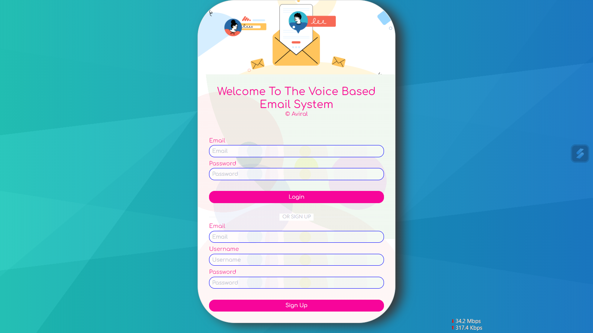
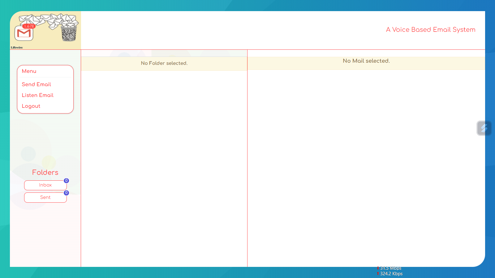
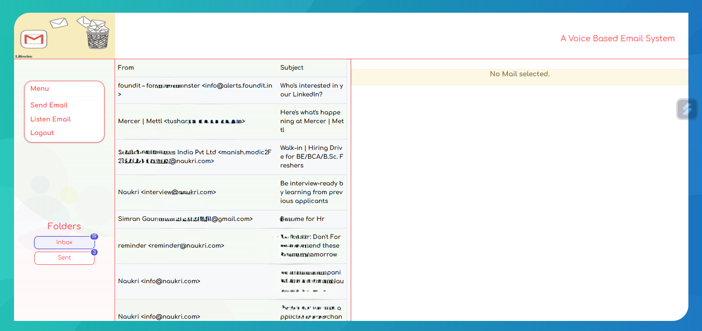
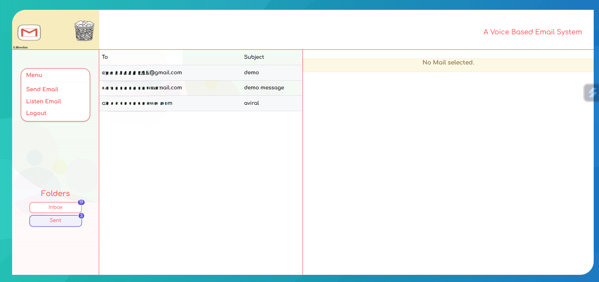
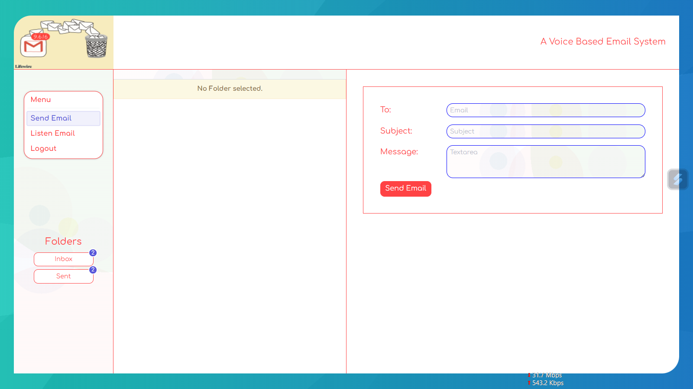

# Voice-Based-Email-System
Empowering the Visually Impaired with Voice-Activated Email System

Our society is filled with individuals facing various challenges, and it's essential to ensure inclusivity in technology. Innovations aimed at making life easier for people with disabilities are crucial. Thus, this project focuses on creating a voice-activated email system specifically designed for the visually impaired. This web-based application will revolutionize how visually impaired individuals interact with emails, providing features such as:

- Sending Emails: Users can dictate their messages, which will be converted into text.
- Receiving Emails: Incoming emails will be converted into voice messages for easy listening.
- Menu: The application will feature a user-friendly menu, allowing users to navigate and select various functions effortlessly.
- Interface: An intuitive interface will facilitate sending and receiving emails seamlessly.

To achieve these functionalities, the application will utilize speech-to-text and text-to-speech conversion technologies, along with audio playback capabilities. Additionally, implementing a trigger mechanism or keyword recognition process will enable users to select options from the menu efficiently. By developing this innovative solution, we aim to enhance accessibility and independence for the visually impaired community."

# How To Run?
## Install Node.js and npm (Node Package Manager): 
React projects rely on Node.js and npm to manage dependencies and run scripts. You can download and install Node.js from the official website, which includes npm.
Create a React project: If you haven't already, you need to create a React project. You can do this using Create React App, a tool that sets up a new React project with a sensible default configuration. Open your terminal and run:
### 'npx create-react-app my-react-app'
Replace my-react-app with your preferred project name.

Navigate to the project directory: Once the project is created, navigate to the project directory using the terminal:
### 'cd my-react-app'

## Start the development server: 
React projects come with a built-in development server. Start the server by running:
### 'npm i'
### 'npm start'
This command starts the development server and opens your default web browser to display your React application. If it doesn't open automatically, you can access it by visiting http://localhost:3000.

## Develop your React application: 
With the development server running, you can now start working on your React application. You can edit the source files located in the src directory. Any changes you make will be automatically reflected in your browser.

## Stop the development server: 
To stop the development server, go back to your terminal and press Ctrl + C.

That's it! You've successfully run your React project. Remember, during development, the npm start command keeps the server running so you can see changes in real-time. When you're ready to deploy your project, you can build it using npm run build and then deploy the generated build files to a web server.

## Screenshots from the application:
### Login Page

### Home Page

### Inbox Page

### Sent Page

### Send Email Page

